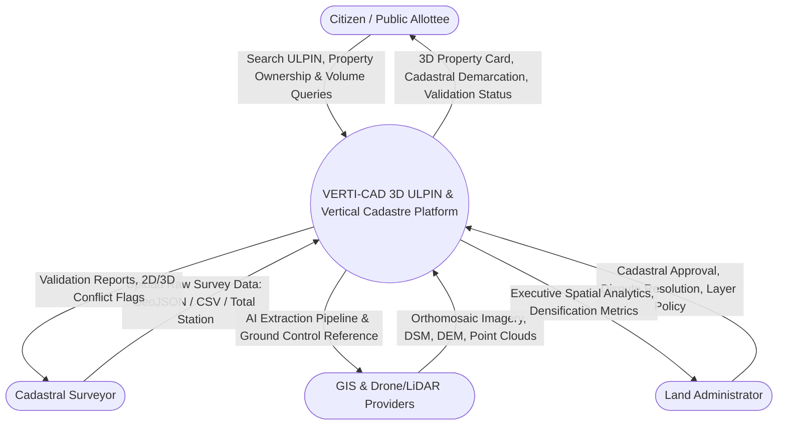
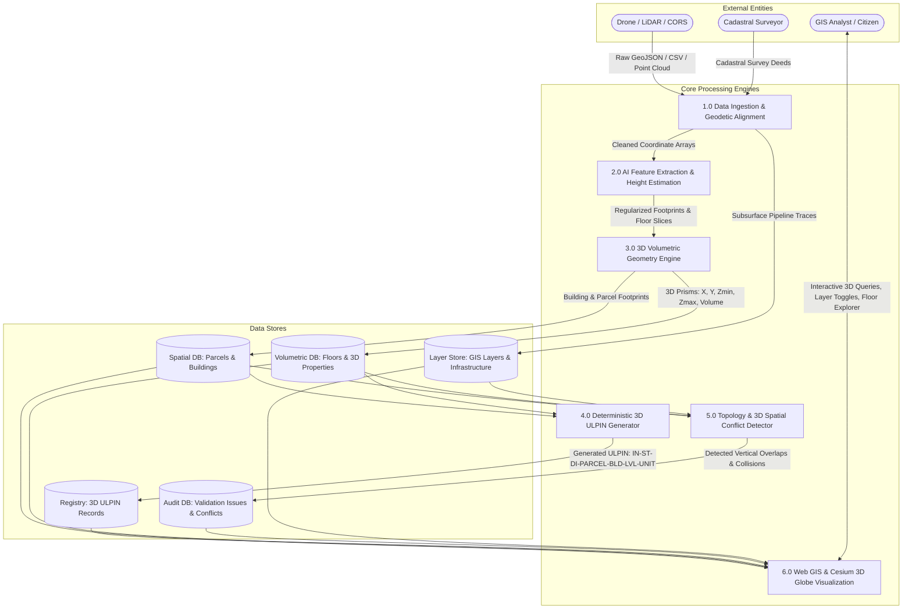

# VERTI-CAD Data Flow Diagrams (DFD)

## DFD Level 0 (Context Diagram)

```mermaid
graph TD
    Citizen([Citizen / Public Allottee])
    Surveyor([Cadastral Surveyor])
    Admin([Land Administrator])
    GISProvider([GIS & Drone/LiDAR Providers])

    System((VERTI-CAD 3D ULPIN & Vertical Cadastre Platform))

    Citizen -->|Search ULPIN, Property Ownership & Volume Queries| System
    System -->|3D Property Card, Cadastral Demarcation, Validation Status| Citizen

    Surveyor -->|Upload Raw Survey Data: GeoJSON / CSV / Total Station| System
    System -->|Validation Reports, 2D/3D Conflict Flags| Surveyor

    GISProvider -->|Orthomosaic Imagery, DSM, DEM, Point Clouds| System
    System -->|AI Extraction Pipeline & Ground Control Reference| GISProvider

    Admin -->|Cadastral Approval, Dispute Resolution, Layer Policy| System
    System -->|Executive Spatial Analytics, Densification Metrics| Admin
```

---

## DFD Level 1 (Functional Decomposition)

```mermaid
graph TD
    subgraph External Entities
        Surveyor([Cadastral Surveyor])
        GISUser([GIS Analyst / Citizen])
        Sensors([Drone / LiDAR / CORS])
    end

    subgraph Core Processing Engines
        P1[1.0 Data Ingestion & Geodetic Alignment]
        P2[2.0 AI Feature Extraction & Height Estimation]
        P3[3.0 3D Volumetric Geometry Engine]
        P4[4.0 Deterministic 3D ULPIN Generator]
        P5[5.0 Topology & 3D Spatial Conflict Detector]
        P6[6.0 Web GIS & Cesium 3D Globe Visualization]
    end

    subgraph Data Stores
        D1[(Spatial DB: Parcels & Buildings)]
        D2[(Volumetric DB: Floors & 3D Properties)]
        D3[(Registry: 3D ULPIN Records)]
        D4[(Audit DB: Validation Issues & Conflicts)]
        D5[(Layer Store: GIS Layers & Infrastructure)]
    end

    Sensors -->|Raw GeoJSON / CSV / Point Cloud| P1
    P1 -->|Cleaned Coordinate Arrays| P2
    P2 -->|Regularized Footprints & Floor Slices| P3
    Surveyor -->|Cadastral Survey Deeds| P1

    P3 -->|3D Prisms: X, Y, Zmin, Zmax, Volume| D2
    P3 -->|Building & Parcel Footprints| D1
    P1 -->|Subsurface Pipeline Traces| D5

    D1 & D2 --> P4
    P4 -->|Generated ULPIN: IN-ST-DI-PARCEL-BLD-LVL-UNIT| D3

    D1 & D2 & D5 --> P5
    P5 -->|Detected Vertical Overlaps & Collisions| D4

    D1 & D2 & D3 & D4 & D5 --> P6
    GISUser <-->|Interactive 3D Queries, Layer Toggles, Floor Explorer| P6
```
