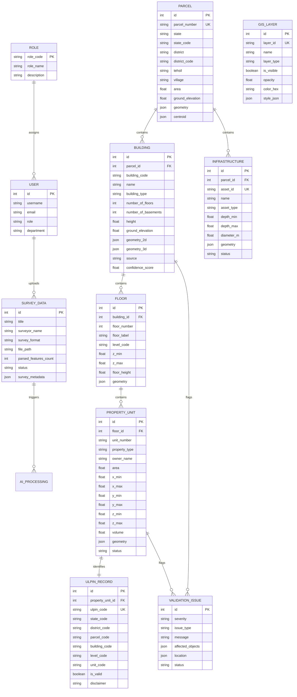

# VERTI-CAD Entity-Relationship (ER) Diagram

```mermaid
erDiagram
    ROLE ||--o{ USER : assigns
    USER ||--o{ SURVEY_DATA : uploads
    PARCEL ||--o{ BUILDING : contains
    PARCEL ||--o{ INFRASTRUCTURE : contains
    BUILDING ||--o{ FLOOR : contains
    FLOOR ||--o{ PROPERTY_UNIT : contains
    PROPERTY_UNIT ||--|| ULPIN_RECORD : identifies
    PROPERTY_UNIT ||--o{ VALIDATION_ISSUE : flags
    BUILDING ||--o{ VALIDATION_ISSUE : flags
    SURVEY_DATA ||--o{ AI_PROCESSING : triggers

    USER {
        int id PK
        string username
        string email
        string role
        string department
    }

    ROLE {
        string role_code PK
        string role_name
        string description
    }

    PARCEL {
        int id PK
        string parcel_number UK
        string state
        string state_code
        string district
        string district_code
        string tehsil
        string village
        float area
        float ground_elevation
        json geometry
        json centroid
    }

    BUILDING {
        int id PK
        int parcel_id FK
        string building_code
        string name
        string building_type
        int number_of_floors
        int number_of_basements
        float height
        float ground_elevation
        json geometry_2d
        json geometry_3d
        string source
        float confidence_score
    }

    FLOOR {
        int id PK
        int building_id FK
        int floor_number
        string floor_label
        string level_code
        float z_min
        float z_max
        float floor_height
        json geometry
    }

    PROPERTY_UNIT {
        int id PK
        int floor_id FK
        string unit_number
        string property_type
        string owner_name
        float area
        float x_min
        float x_max
        float y_min
        float y_max
        float z_min
        float z_max
        float volume
        json geometry
        string status
    }

    ULPIN_RECORD {
        int id PK
        int property_unit_id FK
        string ulpin_code UK
        string state_code
        string district_code
        string parcel_code
        string building_code
        string level_code
        string unit_code
        boolean is_valid
        string disclaimer
    }

    INFRASTRUCTURE {
        int id PK
        int parcel_id FK
        string asset_id UK
        string name
        string asset_type
        float depth_min
        float depth_max
        float diameter_m
        json geometry
        string status
    }

    VALIDATION_ISSUE {
        int id PK
        string severity
        string issue_type
        string message
        json affected_objects
        json location
        string status
    }

    GIS_LAYER {
        int id PK
        string layer_id UK
        string name
        string layer_type
        boolean is_visible
        float opacity
        string color_hex
        json style_json
    }

    SURVEY_DATA {
        int id PK
        string title
        string surveyor_name
        string survey_format
        string file_path
        int parsed_features_count
        string status
        json survey_metadata
    }
```
